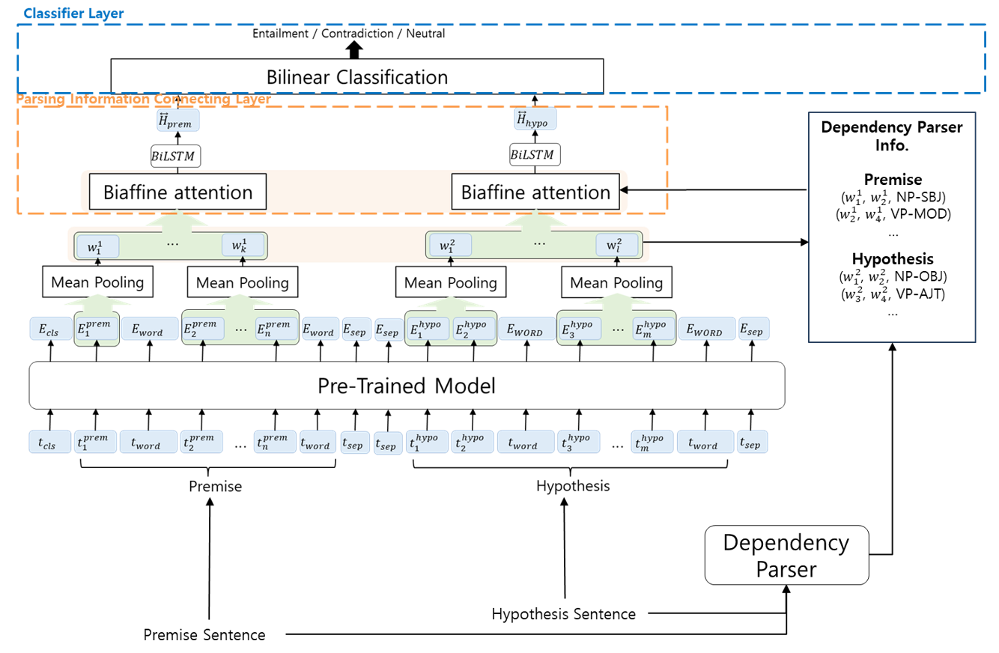

# Natural Language Inference using Dependency Parsing
Code for HCLT 2021 paper: *[Natural Language Inference using Dependency Parsing](https://koreascience.kr/article/CFKO202130060562801.page?&lang=ko)*


## Setting up the code environment

```
$ virtualenv --python=python3.7 venv
$ source venv/bin/activate
$ pip install -r requirements.txt
```


All code only supports running on Linux.

## Data

Korean Language Understanding Evaluation-Natural Language Inference version1: *[KLUE-NLI](https://klue-benchmark.com/tasks/68/data/description)*

### Directory and Pre-processing
`의존 구문 분석 모델은 미공개(The dependency parser model is unpublished)`
```
├── data
│   ├── klue-nli-v1_train.json
│   ├── klue-nli-v1_dev.json
│   └── parsing
│       ├── parsing_1_klue_nli_train.json
│       └── parsing_1_klue_nli_dev.json
│   └── merge
│       ├── parsing_1_klue_nli_train.json
│       └── parsing_1_klue_nli_dev.json
├── roberta
│   ├── init_weight
│   └── my_model
├── src
│   ├── dependency
│       └── merge.py
│   ├── functions
│       ├── biattention.py
│       ├── utils.py
│       ├── metric.py
│       └── processor.json
│   └── model
│       ├── main_functions.py
│       └── model.py
├── run_NLI.py
├── requirements.txt
└── README.md
```

* 원시 데이터(data/klue-nli-v1_train.json)를 의존 구문 분석 모델을 활용하여 입력 문장 쌍에 대한 어절 단위 의존 구문 구조 추출(data/parsing/klue-nli-v1_train.json)

* 입력 문장 쌍에 대한 어절 단위 의존 구문 구조(data/parsing/klue-nli-v1_train.json)를 `src/dependency/merge.py`를 통해 입력 문장 쌍에 대한 청크 단위 의존 구문 구조로 변환(data/merge/klue-nli-v1_train.json)

* [roberta/init_weight](https://huggingface.co/klue/roberta-base)/vocab.json에 청크 단위로 구분해주는 스폐셜 토큰(Special Token) `<WORD>` 추가


## Model Structure



## Train & Test

```
python run_NLI.py
```

## Results on KLUE-NLI

| Model | Acc |
|---|--------- |
| NLI w/ DP | 90.78% |
